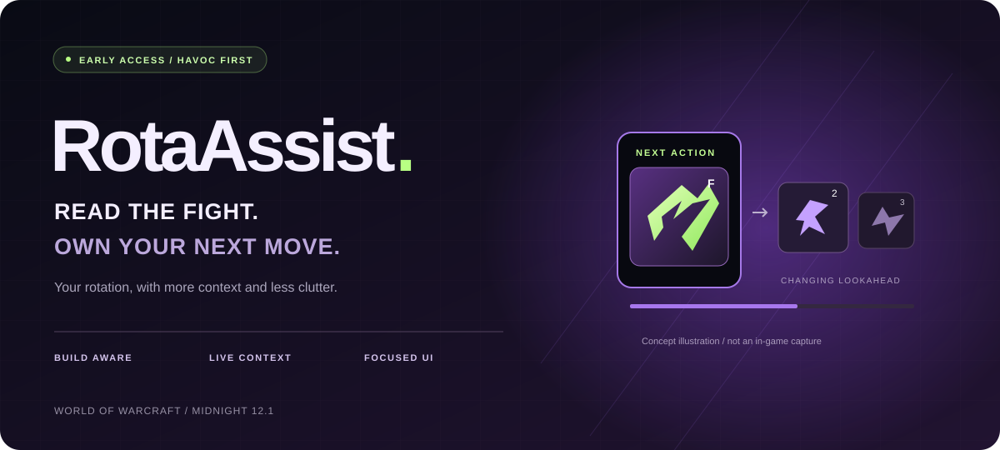
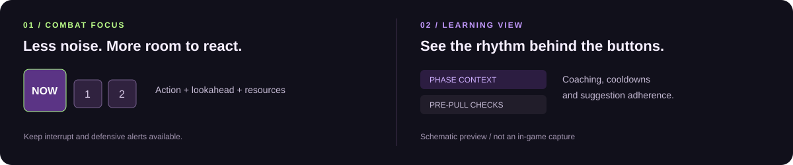

<strong>Less time watching your bars. More attention on the fight.</strong> A rotation coach for WoW Midnight, with next-action guidance, changing lookahead and combat reminders.

  
  
  

<a href="README.md">简体中文</a> · English <a href="#start-in-three-steps">Install</a> · <a href="https://github.com/cantascendia/RotaAssist/releases/tag/1.1.1-rc.17">Release notes</a> · <a href="https://github.com/cantascendia/RotaAssist/issues">Report an issue</a>

> **Early access. Havoc first.** This is an installable test build. The default path combines Blizzard Assisted Combat with addon lookahead; independent recommendations are opt-in. Live raid/Mythic+ acceptance is still pending, and maximum DPS is not guaranteed. Images are conceptual illustrations, not game captures.

## The fight changes. Your next move should follow.

A target switch. A burst window. An enemy moving out of melee range. RotaAssist brings **your character configuration, publicly readable combat state and spell history** into the recommendation flow.

The large icon shows the next action. Smaller icons show possible follow-ups. Those forecasts update as the available state changes.

| What you need | What RotaAssist provides |
| :--- | :--- |
| **Keep up with build changes** | Event-driven refreshes for talents, equipment, attributes and learned spells; Havoc experimental policies recognize Fel-Scarred and Aldrachi builds. |
| **React to the current target** | Target and public range observations, plus a lower bound on nearby enemy count. Unconfirmed state stays unknown. |
| **Prepare the next button** | Multi-step forecasts from supported APLs, with two forecast slots by default. These are changing predictions, not a fixed combo. |
| **Keep the screen readable** | Combat focus keeps recommendations, resources and safety alerts while hiding learning panels. |
| **Practice your rhythm** | Learning view adds phase context, pre-pull checks, cooldowns and suggestion adherence. |

**Players do not need Python, model training or a character export to install and use the addon.** Research tools are optional.

## Two views. One focus: the fight.

### ⚔️ Combat focus

Keep your attention on the encounter. Recommendation textures update immediately by default. Out-of-range cues use both text and color. Native action-bar page changes, extra bars and spell replacements invalidate cached key labels.

### 🔮 Learning view

Expand the coaching information while practicing: phases, preparation, cooldowns and suggestion adherence. **Adherence measures whether you followed a suggestion, not the quality of your DPS.** Position, scale, sounds and display options remain customizable.

The UI supports **English · 简体中文 · 日本語**. See the [UX audit](docs/ux-readiness.md) or download and open the [interactive schematic](docs/ux-preview.html) in a browser.

## Start in three steps

1. **[Download the installable ZIP →](https://github.com/cantascendia/RotaAssist/releases/download/1.1.1-rc.17/RotaAssist-1.1.1-rc.17.zip)** Choose **RotaAssist-1.1.1-rc.17.zip**, not GitHub's automatic Source code archive. Libraries are bundled.
2. **Close WoW and extract the RotaAssist folder** into the retail client's AddOns directory. The final path must be <code>World of Warcraft/_retail_/Interface/AddOns/RotaAssist/RotaAssist.toc</code>. Back up an older installation outside AddOns when upgrading; keep your character settings.
3. **Enable the addon and run <code>/ra config</code>.** Choose Combat focus or Learning view. Use <code>/ra lock</code> to toggle dragging, place the strip, then start with a target dummy.

Target: **Midnight 12.1 / Interface 120100**. Check key labels, target switches and talent changes before taking it into a dungeon. [Full installation guide](docs/USER_QUICK_START.md)

## Build depth before breadth

| Specialization | Current scope |
| :--- | :--- |
| **Havoc** | Primary development and validation focus. Build context, public combat observations, lookahead, and optional Fel-Scarred/Aldrachi independent policies. |
| Vengeance | Candidate data is loaded; dedicated live validation remains pending. |
| Devourer | Blizzard suggestions only; unverified APL predictions are disabled. |
| Other specs | Research data in the repository does not imply complete addon support. |

For independent-policy testing, use <code>/ra independent on</code> and <code>/ra independent off</code>. Experimental heads carry an **EXP** label; insufficient evidence falls back. **Keep the default mode for your first session.**

<strong>Evidence and limits: what has actually been verified?</strong>

This release passed **787 Lua tests**, **131 Python tests**, syntax checks for **172 Lua files**, and **19 deliberately broken behavioral mutations**. The ZIP also passed directory, ordered-load and per-file SHA-256 checks. These are offline engineering checks.

A complete damage/state-transition model, validated dynamic search and live encounter comparisons remain unfinished. Existing fixed-build independent-policy simulations still trail the full reference rotation.

- Nearby enemy counts are observed lower bounds, not a complete battlefield census or a guarantee of AoE hits.
- Restricted state remains unknown. There is no game-memory reading, key injection or automatic casting.
- Conditional macros, third-party action bars, all talent combinations and live frame-time performance need further compatibility testing.

[Validation record](research/combat-ux/verification.json) · [Quality criteria](docs/QUALITY_BASELINE.md) · [Optimality reasoning and evidence](research/optimality-evidence/README.md)

## Useful commands

| Command | Purpose |
| :--- | :--- |
| <code>/ra config</code> | Settings and view presets |
| <code>/ra lock</code> | Toggle position locking |
| <code>/ra toggle</code> | Show or hide the main display |
| <code>/ra build</code> | Inspect character configuration reads |
| <code>/ra capture on</code> / <code>/ra capture off</code> | Start or stop a local public-decision trace |
| <code>/ra version</code> | Check the installed version |

Capture is off by default and retains up to 1200 recent events. Starting a capture replaces the previous one. Stop it, then reload or log out normally to save. It is neither a full combat log nor a DPS measurement.

## Help make it worth keeping on your bars

Wrong keys, flickering suggestions or missed recommendations? **[Open an issue →](https://github.com/cantascendia/RotaAssist/issues/new)** Include the addon/client version, spec and hero talents, reproduction steps and any Lua error. Concrete encounters help us improve.

If this is the kind of rotation coach you want, **Star** the project and follow [Releases](https://github.com/cantascendia/RotaAssist/releases) for updates.

<strong>For developers</strong>

Lua 5.1 addon + Python research tooling. Players need neither development environment.

<pre>&amp; 'C:\Program Files (x86)\Lua\5.1\lua.exe' scripts/run_tests.lua
python -m pytest tests training/test_apl_parser.py -q
&amp; scripts/package_release.ps1</pre>

[Architecture](docs/ARCHITECTURE.md) · [API](docs/API_REFERENCE.md) · [Dependencies](docs/DEPENDENCIES.md) · [Training](training/README.md) · [Changelog](CHANGELOG.md)

---

Open source · <a href="LICENSE">MIT</a> · Thanks to Blizzard's public APIs, SimulationCraft and Ace3. An independent community project, not affiliated with or endorsed by Blizzard Entertainment. World of Warcraft belongs to its respective trademark owner.

